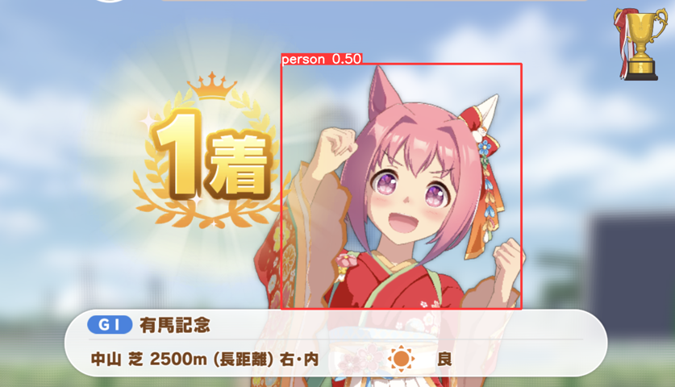
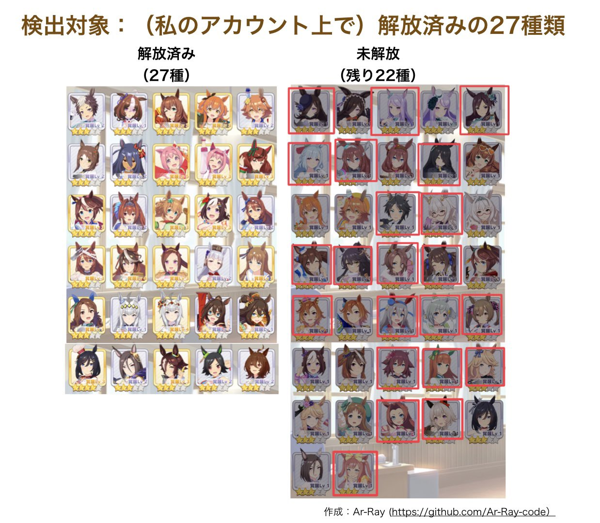
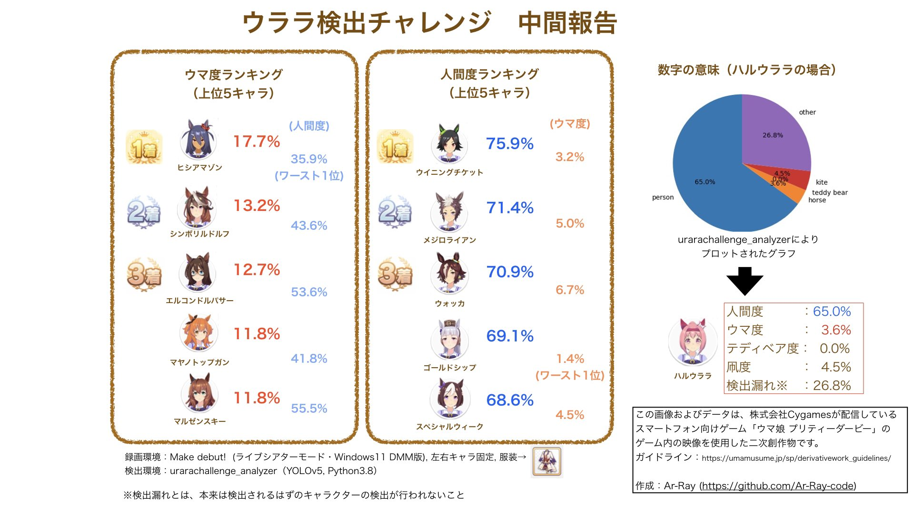
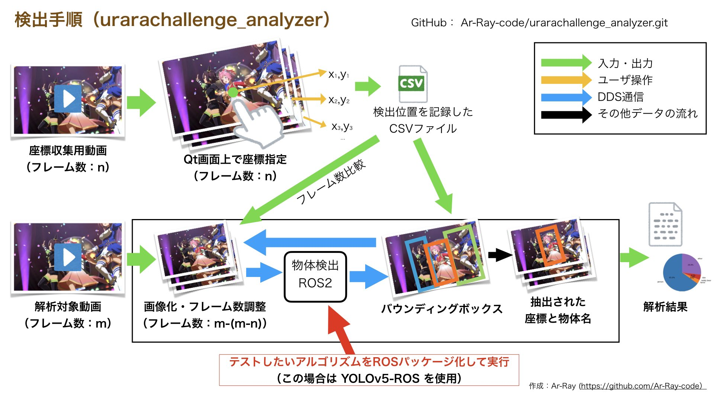
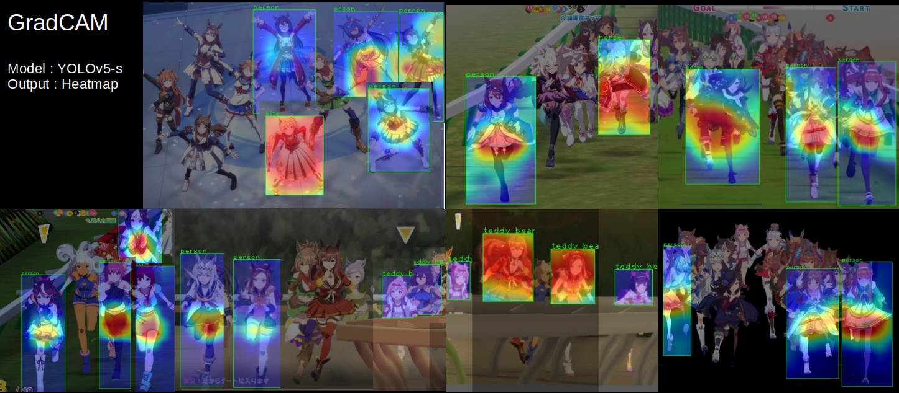

# urara-challenge（ウララ検出チャレンジ）
ハルウララ（ウマ娘）のテスト結果です。

[レポートサイト（GitHub Pages）](https://ar-ray-code.github.io/urara-challenge/)

↑画像をクリックするとニコニコ動画のURLに飛びます。

### ニコニコ動画

[ウマ娘はAI的に馬？人間？の検証（ハルウララのシニア有馬記念1着攻略解説あり）-ニコニコ動画](https://nico.ms/sm39930385)

## 検証環境

- [darknet-YOLOv4-csp](https://github.com/Ar-Ray-code/darknet/tree/export-video)：改造しているためリンクはAr-Ray-codeのリポジトリに飛びます。
- [YOLOX-x](https://github.com/Megvii-BaseDetection/YOLOX)
- [yolov5](https://github.com/ultralytics/yolov5)
- ウィニングライブ（対象のキャラクターはセンターであること）
- レース（対象のキャラクターは1着であること）

## コンピュータ

※検出率の実験であるため、コンピュータ性能に左右されません。

- CPU：Intel Core i9 12900KF
- GPU：NVIDIA GeForce RTX 2080Ti
- RAM：64GB

## 対象

<!--  

対象キャラ
 -->
全て。動画提供についてはこちらから→https://github.com/Ar-Ray-code/urara-challenge/wiki/動画のレギュレーション

<!-- 
 -->

対象ライブ

Make Debut!，服装　左右キャラ固定

- [x] Make Debut!
- [ ] ENDLESS DREAM!!
- [ ] 彩 Phantasia
- [ ] winnning the soul
- [ ] 本能スピード
- [ ] [UNLIMITED IMPACT](https://www.youtube.com/watch?v=AvsvLLgowQg)
- [ ] NEXT FRONTIER
- [ ] Special Record!
- [ ] [うまぴょい伝説](https://youtu.be/Ol8nYpTHX4c)
- [ ] はじまりのSignal
- [ ] ささやかな祈り
- [ ] 涙ひかって明日になれ！
- [ ] ユメヲカケル！
- [ ] BLAZE
- [ ] Never Looking Back
- [ ] WINnin’5 -ウイニング☆ファイヴ-
- [ ] ぴょいっと♪はれるや！
  

対象レース

芝・ダート・右回り・左回りなどの条件を確認中

- [x] 京都 芝 晴れ

  <!-- 
## 検出例（画像をクリックでYouTubeのリンクに飛びます）

### UNLIMITED IMPACT

検出結果：未

 

### うまぴょい伝説

### ユメヲカケル!

 -->

## ウマ娘ごとの検出結果

GitHub：[urarachallenge_analyzer](https://github.com/Ar-Ray-code/urarachallenge_analyzer)

### GradCAM

yolov5+pytorch-grad-camの組み合わせによる解析結果。以下の画像はアウトプットを手動合成したものになります。

参考リポジトリ：https://github.com/pooya-mohammadi/yolov5-gradcam

## レポート

[検出結果レポート（GitHub Pages）](https://ar-ray-code.github.io/urara-challenge/)を公開しています。

 

## その他

[ウララチャレンジ（ゲームの方）](https://github.com/Ar-Ray-code/urara-challenge/wiki/%E3%82%A6%E3%83%A9%E3%83%A9%E3%83%81%E3%83%A3%E3%83%AC%E3%83%B3%E3%82%B8%E3%81%AE%E9%81%8A%E3%81%B3%E6%96%B9%EF%BC%88%E3%82%B2%E3%83%BC%E3%83%A0%E3%81%AE%E6%96%B9%EF%BC%89)
- 「ウララチャレンジ」という単語はゲーム内ではハルウララの適正外レースに出走することを指します。有馬記念のクラシック・シニア級の勝利時に固定イベントがあります。

## 貢献について

気になる箇所やモデルについての検証結果やリクエストなどがあれば歓迎します。

issue欄や[Twitter](https://twitter.com/Ray255Ar)などで教えてください。

## ライセンス

このプロジェクトはCC4.0ライセンスのBY-NCに基づいて改変・再配布が可能です。利用は非営利目的に限定されます。
